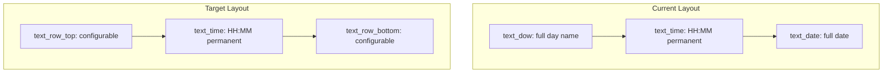
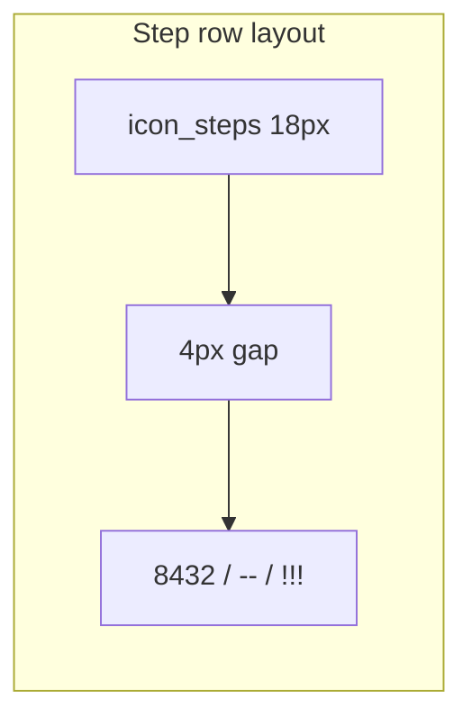

# Configurable Top/Bottom Display Rows

Design and implementation plan for refactoring Clean & Smart watchface rows.

**Status:** Phase 3 complete. Phase 4 (testing) not started.

**Build system:** `rebble` is a symlink to `pebble` in `~/.local/bin` (Makefile unchanged).

---

## Implementation phases (order of work)

| Phase | What | Done |
|---|---|---|
| **0** | [Dev environment & tooling](#phase-0-dev-environment--tooling) | yes |
| **1** | [Assets](#phase-1-assets) — step icon PNG | yes |
| **2** | [Settings plumbing](#settings--persistence) — message keys, Clay, PKJS | yes |
| **3** | [Core C refactor](#architecture) — rows, formatters, health, focus | yes |
| **4** | [Testing](#testing-checklist) | |

---

## Phase 0: Dev environment & tooling

Complete this **before** any feature code. Goal: a clean build of the **current** watchface on your machine.

Setup guide: [`arm64-pebble-dev.md`](arm64-pebble-dev.md) (bootstrap, pypkjs/stpyv8 workarounds, emulator smoke test).

### Environment

- **OS:** WSL2 Ubuntu (arm64)
- **Node.js:** v22+ and npm — installed
- **Python:** 3.13 via `uv` in `~/.local/pebble-sdk-venv` (system is 3.14, too new for full `pebble-tool` install)

### System packages (sudo — you run this)

Needed for **emulator** and icon resize:

```bash
sudo apt-get update
sudo apt-get install -y libsdl2-2.0-0 libsndio7.0 imagemagick
```

Build compiles without these; emulator needs SDL.

### Pebble CLI + SDK (no sudo)

See [`arm64-pebble-dev.md`](arm64-pebble-dev.md) for the full pypkjs/stpyv8 story. Summary: emulator install works; PKJS (settings/weather) does not run in the emulator on arm64.

```bash
export PATH="$HOME/.local/bin:$PATH"
source ~/.local/pebble-sdk-venv/bin/activate   # optional; rebble/pebble also symlinked in ~/.local/bin
pebble --version
pebble sdk list
```

Makefile compatibility:

```bash
rebble build    # symlink to pebble
```

SDK installed: **4.9.169** at `~/.local/share/pebble-sdk/`.

### Project npm dependencies

```bash
npm install
```

### Baseline build (verified)

```bash
rebble build
# Output: build/Clean_and_Smart.pbw
```

### Emulator smoke test

See [`arm64-pebble-dev.md`](arm64-pebble-dev.md#emulator-smoke-test).

```bash
rebble kill --force
rebble install --emulator basalt
```

### Phase 0 checklist

- [x] `uv` + Python 3.13 venv + `pebble-tool`
- [x] `pebble sdk install latest`
- [x] `rebble` symlink for Makefile
- [x] `npm install`
- [x] `rebble build` succeeds
- [x] `sudo apt` emulator libs + ImageMagick
- [x] Emulator install (`rebble install --emulator basalt`)

---

## Phase 1: Assets

**Done.** `resources/images/icon_steps.png` (18×18, 1-bit-style silhouette with alpha) registered as `ICON_STEPS` in `package.json`. Wired in C code in Phase 3.

### Step icon (reference)

Created from the approved two-shoe-prints design. To regenerate:

```bash
convert <source> -resize 18x18 -background none -gravity center -extent 18x18 \
  -fuzz 10% -transparent white -colorspace Gray -threshold 50% \
  PNG32:resources/images/icon_steps.png
```

Registered in [`package.json`](../package.json) as `ICON_STEPS`:

```json
{
  "file": "images/icon_steps.png",
  "name": "ICON_STEPS",
  "type": "bitmap"
}
```

---

## Goal

Replace the rigid layout in [`src/c/main.c`](../src/c/main.c):



Each row independently selects one of four modes:

| Value | Mode | Example output |
|---|---|---|
| 0 | Full day name | `WEDNESDAY` / `onsdag` |
| 1 | Full date | `DEC-10-2015` (uses existing `KEY_DATE_FORMAT`) |
| 2 | Step count | `[foot] 8432` — step icon + number; `--` or `!!!` when unavailable/overflow |
| 3 | Abbreviated DOW + abbreviated date | `SAT 20-JUN-2026` — **both** parts abbreviated, combined in one row |

**Defaults (new installs):** top = 0 (full DOW), bottom = 1 (full date) — matches current behavior.

---

## Architecture

### New row rendering pipeline

Extract formatting from `tick_handler()` into dedicated helpers in [`src/c/main.c`](../src/c/main.c):

```c
typedef enum {
  ROW_FULL_DOW = 0,
  ROW_FULL_DATE = 1,
  ROW_STEPS = 2,
  ROW_ABBR_DOW_DATE = 3,
} RowDisplayMode;

static void format_full_dow(char *buf, size_t len, struct tm *t);
static void format_full_date(char *buf, size_t len, struct tm *t);
static void format_abbr_dow_date(char *buf, size_t len, struct tm *t);
static void format_steps(char *buf, size_t len);
static void update_row(TextLayer *layer, RowDisplayMode mode, struct tm *t);
static void refresh_rows(TimeUnits units_changed);
```

- **`format_full_date`** — move existing `switch (flag_dateFormat)` logic from `tick_handler` (lines 188–225); unchanged behavior.
- **`format_full_dow`** — move existing DOW logic (lines 229–237): custom `LANG_DAY[]` when `flag_language != LANG_DEFAULT`, else `strftime(..., "%A", ...)`.
- **`format_abbr_dow_date`** — **abbreviated DOW + abbreviated date** in one string (mode 3):
  - **Abbrev DOW:** `%a` / `LANG_DAY_ABBR[]` (≤3 chars).
  - **Abbrev date:** 3-char month from `%b` / `LANG_MONTH_UPPER[]`; day + year per `KEY_DATE_FORMAT`. Never `%B` or `%A`.
  - **Combined layout** per `KEY_DATE_FORMAT`:
    - Format 0 (MDY): `{ABBR_DOW} {MON}-{DD}-{YYYY}` e.g. `SAT JUN-20-2026`
    - Format 1 (DMY): `{ABBR_DOW} {DD}-{MON}-{YYYY}` e.g. `SAT 20-JUN-2026`
    - Format 2 (YMD): `{ABBR_DOW} {YYYY}-{MM}-{DD}` e.g. `SAT 2026-06-20`
- **`format_steps`** — health API or `"--"`; overflow → `"!!!"`:

```c
HealthValue steps = health_service_sum_today(HealthMetricStepCount);
if (steps > 99999) {
  snprintf(buf, len, "!!!");
} else {
  snprintf(buf, len, "%d", (int)steps);
}
```

### Step icon (mode 2 only)

When a row is in step mode, show footsteps icon **left** of the count (including `--` and `!!!`).



- Load `RESOURCE_ID_ICON_STEPS`, tint via `tint_step_icon()` (mirror `tint_meteoicon()`)
- `step_icon_top` / `step_icon_bottom` `BitmapLayer`s — hidden when row not in step mode
- `layout_step_row()` centers icon+text group in row bounds

| Old | New | Rect position (unchanged) |
|---|---|---|
| `text_dow` | `text_row_top` + `step_icon_top` | y ≈ 30, full width |
| `text_date` | `text_row_bottom` + `step_icon_bottom` | y ≈ 129, full width |

### Update triggers

| Mode | When to refresh |
|---|---|
| Full DOW | `DAY_UNIT` |
| Full date | `DAY_UNIT` |
| Abbr DOW + abbr date | `DAY_UNIT` |
| Steps (default) | `MINUTE_UNIT`; `HealthEventSignificantUpdate`; init; focus resume |
| Steps (live, opt-in) | Also `HealthEventMovementUpdate` when `KEY_LIVE_STEPS` enabled |
| All rows + time | `AppFocusService` `did_focus(true)` |

### Battery / refresh frequency

Each display update costs battery. Default: **minute-level** refresh for steps (matches time/date).

**Opt-in live steps (`KEY_LIVE_STEPS`, default off):** also refresh on `HealthEventMovementUpdate`. Call `refresh_steps_rows()` only — not full display redraw.

### Returning from notification — NOT init

`handle_init()` runs once at load. On notification dismiss, use `AppFocusService` `did_focus(true)` to refresh stale UI:

```c
static void app_focus_did_change(bool in_focus) {
  if (!in_focus) return;
  time_t now = time(NULL);
  struct tm *t = localtime(&now);
  tick_handler(t, MINUTE_UNIT | DAY_UNIT);
  refresh_steps_rows();
  battery_handler(battery_state_service_peek());
  layer_mark_dirty(window_layer);
}
```

Clay settings save via AppMessage — separate path, no focus event needed.

---

## Health API integration

Add to [`package.json`](../package.json):

```json
"capabilities": ["location", "configurable", "health"]
```

```c
#if defined(PBL_HEALTH)
  health_service_events_subscribe(health_handler, NULL);
#endif
```

```c
static void health_handler(HealthEventType event, void *context) {
  bool has_step_row = (flag_topRow == ROW_STEPS || flag_bottomRow == ROW_STEPS);
  if (!has_step_row) return;
  if (event == HealthEventSignificantUpdate) {
    refresh_steps_rows();
  } else if (event == HealthEventMovementUpdate && flag_live_steps) {
    refresh_steps_rows();
  }
}
```

- `aplite`: no `PBL_HEALTH` — show `"--"`
- Omitting `"health"` capability kills the app on health-capable platforms

---

## Settings / persistence

### New message keys

| Key | ID | Purpose |
|---|---|---|
| `KEY_TOP_ROW` | 6 | Top row mode (0–3) |
| `KEY_BOTTOM_ROW` | 8 | Bottom row mode (0–3) |
| `KEY_LIVE_STEPS` | 9 | 0 = minute only, 1 = live |

### Clay — [`src/pkjs/config.json`](../src/pkjs/config.json)

**Display Rows** section: two selects (defaults top=0, bottom=1) plus live steps toggle.

### PKJS — [`src/pkjs/app.js`](../src/pkjs/app.js)

Forward and persist new keys in `current_settings`.

Legacy [`html/clean_smart_config.htm`](../html/clean_smart_config.htm): do not update.

### Previewing Clay on arm64 (visual only)

Emulator PKJS is unavailable on arm64 WSL; use Chrome on Windows to review the settings **layout** after editing `config.json`. See [`arm64-pebble-dev.md` — Clay settings visual check](arm64-pebble-dev.md#clay-settings-visual-check):

```bash
rebble build
node docs/tools/clay-preview-url.js
# open build/clay-preview.html in Windows Chrome
```

Full save-to-watch testing still requires `rebble install --phone <ip>` locally, or build/install from [CloudPebble](arm64-pebble-dev.md#optional-cloudpebble-remix) (full PKJS in the browser emulator).

---

## Typography and casing

| Mode | English | Custom Latin | Russian |
|---|---|---|---|
| Full DOW (0) | `strftime %A` | existing `LANG_DAY` | existing ALL CAPS |
| Full date (1) | `strftime %b` | existing `LANG_MONTH` | existing ALL CAPS |
| Abbr DOW + date (3) | `%a` + `%b` uppercase | `LANG_DAY_ABBR` + `LANG_MONTH_UPPER` ALL CAPS | ALL CAPS e.g. `СБ 20-ЯНВ-2026` |

**Font:** only `LANG_RUSSIAN` uses `Big_Noodle_Titling_Cyr.ttf`. Polish uses Latin font but shares wider 6-char month slot with Russian in date formatting.

Add `LANG_DAY_ABBR[9][7][4]` and `LANG_MONTH_UPPER[9][12][6]` to [`src/c/languages.h`](../src/c/languages.h).

---

## File change summary

| File | Changes |
|---|---|
| [`src/c/languages.h`](../src/c/languages.h) | `LANG_DAY_ABBR`, `LANG_MONTH_UPPER` |
| [`src/c/main.h`](../src/c/main.h) | `RowDisplayMode`, new message keys |
| [`src/c/main.c`](../src/c/main.c) | Rows, formatters, step icon, health, focus |
| [`src/pkjs/config.json`](../src/pkjs/config.json) | Row selects + live steps |
| [`src/pkjs/app.js`](../src/pkjs/app.js) | Forward/persist keys |
| [`package.json`](../package.json) | `messageKeys`, `health`, `ICON_STEPS`, version bump |
| [`resources/images/icon_steps.png`](../resources/images/icon_steps.png) | From approved design |

No changes to [`Makefile`](../Makefile), [`wscript`](../wscript), or npm dependencies.

---

## Testing checklist

1. Phase 0 baseline build passes
2. Default layout matches current watchface
3. Each row mode on top and bottom (spot-check combinations)
4. Steps on `emery`/`diorite`: icon + count; `--` when unavailable
5. Live steps off: updates ≤1/min; live steps on: updates while walking
6. Steps on `aplite`: `--`, no crash
7. Step overflow >99999: `[icon] !!!`
8. Language switching in abbr mode (Swedish, Russian, Italian)
9. Date format affects mode 1 and mode 3 ordering
10. Clay settings persist across reload
11. Focus resume after notification refreshes display
12. Round (`chalk`): longest strings don't clip

---

## Risks and mitigations

| Risk | Mitigation |
|---|---|
| Mode 3 too long on round | DOW ≤3 chars; 3-char months; test Polish/Catalan/Russian |
| Polish uses Latin, not Cyrillic | Only Russian loads Cyrillic font; verify Polish diacritics in abbr tables |
| Polish/Russian wider month field | Reuse 6-char month slot logic from full date |
| ALL CAPS accented chars | Explicit upper tables, not runtime `toupper` |
| Mode 3 vs mode 1 confusion | Separate formatters and Clay labels |
| Step icon + 5 digits on round | Center icon+text group; shrink gap if needed |
| Step count >99999 | Show `!!!` |
| Missing `health` capability | Add before any Health API call |
| Steps unavailable | Show `--`; `PBL_HEALTH` guards |
| Live steps battery drain | Default off; MovementUpdate redraws step rows only |
